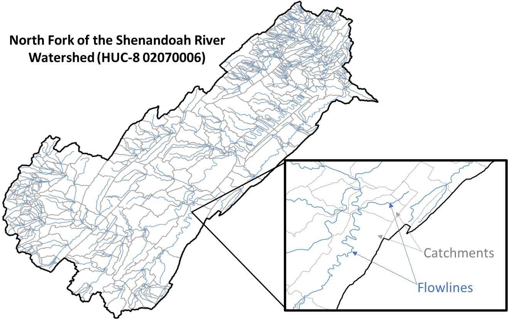

```{r setup, include=TRUE}
knitr::opts_chunk$set(echo = TRUE, message = FALSE, warning = FALSE)
```

## Using `nhdplusTools`

The goal of this assignment is to introduce us to the package `nhdplusTools`. This package allows R users to explore and manipulate the [National Hydrography Dataset (NHD)](https://www.usgs.gov/national-hydrography/national-hydrography-dataset). The NHD is a digital database that represents the United States' water drainage network. Essentially, the database is made up of stream features called flowlines, waterbody polygons (aptly named waterbodies), hydrologically-connected 'chunks' of watersheds called hydrologic unit codes (HUCs, more on that later), and even smaller watershed 'chunks' called catchments. For every flowline, there is a catchment associated with it that represents the drainage area that directly contributes to its surface flow. Flowlines and catchments can be linked up using each flowline's unique `comid` and each catchment's unique `featureid`, which are the same value for related flowlines and catchments. (For whatever reason, they aren't called the same thing in the catchment dataset. 😑) Waterbodies can also be linked to the catchment that they are within using their associated `comid`s.



## HUCs

Watersheds are delineated by the USGS using a nested coding system. The highest order, HUC-2 (e.g. '01'), divides the US into 21 large watersheds, which are then further divided into HUC-4 units (e.g., '0102', '0103'), which are then divided into HUC-6 units, etc. etc. It is important to remember that not all HUCs are true watersheds!


To demonstrate some of the functions included in the `nhdplusTools` package, we will be exploring Virginia's North Fork (NF) of the Shenandoah River's watershed, which is fully represented within the "02070006" HUC-8.

## Necessary packages

Beyond the `tidyverse` we will be using `sf` and `mapview` to display geospatial data, and the `nhdplusTools` package to explore the NHD. We will also be using `kableExtra` to make embedded, scrollable data tables.

```{r}
library(tidyverse)
library(sf)
library(mapview)
library(nhdplusTools)
library(kableExtra)
```

## Pulling NHD data

First, let's download all NHD flowline, waterbody, and catchment features found within the NF of the Shenandoah River's watershed. Using the `get_nhdplus()` function in the `nhdplusTools` package, we can download all flowlines and catchments within a chosen area of interest (AOI). `get_waterbodies()` will allow us to download all waterbodies within our AOI. For our example, we can use the watershed's HUC-8 polygon as our AOI using the `get_huc()` function.

```{r}
# Load in a polygon of the HUC-8 of interest. You can also pull 
# in HUCs using a point or polygon feature 
nofo_watershed <- get_huc(id = '02070006', 
                          type = "huc08")

# Pull NHD flowlines within our selected HUC-8 (i.e., our area of interest)
nofo_flowlines <- get_nhdplus(AOI = nofo_watershed,
                              realization = 'flowline') 

# We also want to pull the catchments in our AOI
nofo_catchments <- get_nhdplus(AOI = nofo_watershed,
                               realization = 'catchment') %>% 
 # The get_nhd() function includes catchments along the border of 
 # the nofo_watershed, so we need to filter those out. See what I'm talking 
 # about by commenting out the below line of code!
 filter(featureid %in% nofo_flowlines$comid)
                                           
# Another weird NHD thing - pulling waterbodies requires its own function; 
# it can't be done with get_nhdplus()
nofo_waterbodies <- get_waterbodies(AOI = nofo_watershed)
```

```{r}
# Do they look right?
mapview(nofo_catchments) + 
  mapview(nofo_flowlines) + 
  mapview(nofo_waterbodies)
# ...yes!
```

NHD flowlines contain a wide range of underlying variable data like watershed area, flowline length, stream slope, elevation, etc. etc., as well as fields that are used to navigate through the flowline network. Here's the data table associated with our `nofo_flowlines` polylines:

```{r}
nofo_flowlines %>%
    kable(.,'html',caption = 'NHD Metadata') %>%
    kable_styling() %>%
    scroll_box(width = '900px', height = '400px')
```

A description of all NHD variables in this flowline data table can be found in [this user guide](https://nhdplus.com/NHDPlus/NHDPlusV2_documentation.php#NHDPlusV2%20User%20Guide)... it's big and may take some time to load!

## Finding USGS gages with `get_nwis()`

Are there any USGS gages in the NF Shenandoah River's watershed? We can find out by using the `get_nwis()` function, which lists all USGS gages within a given area of interest. This AOI can either be a polygon or a point feature; here, we will again use our polygon of the NF's HUC-8 as our AOI.

```{r}
gages <- get_nwis(AOI = nofo_watershed)

mapview(gages) + 
  mapview(nofo_flowlines) + 
  mapview(nofo_watershed)
```

... It looks like there are plenty of gages here! However, the `get_nwis` function also included gages that are not within our watershed of interest; this is because the function automatically selects any gage within 20 kilometers of the AOI. Let's go ahead and remove those gages:

```{r}
gages <- gages %>%
  # This code is synonymous with ".[nofo_watershed,]":
 filter(st_intersects(., nofo_watershed, sparse = FALSE)) 

mapview(gages) + 
  mapview(nofo_flowlines) + 
  mapview(nofo_watershed)
```

## Calculating distances with `get_path_length()`

Let's say we're interested in identifying each gage's distance upstream of the NF's outlet (i.e., the furthest point downstream of our watershed). `get_pathlength()` could help us with this, as it measures the distance between our "pour point" (i.e., the furthest-downstream flowline in a flowline dataset) and all other upstream flowlines included in that dataset. However, for `get_pathlenth()` to work on our flowlines, we first need to add an additional navigation variable to them (`toCOMID`, done with the `get_tocomid()` function), and we also need to rename a couple fields:

```{r}
# The get_pathlenth() function oddly requires a different formatting 
# and naming convention than what's provided in the raw NHD. Here we 
# are making nofo_flowlines more get_pathlength() friendly :-)
flowlines_for_pathlengths <- get_tocomid(select(nofo_flowlines, -id), 
                                         add = TRUE) %>%
  rename(ID = comid, 
         toID = tocomid)

# Creates a table containing the distance between each flowline and our 
# network's outlet.
distances <- get_pathlength(flowlines_for_pathlengths) %>%
  rename(comid = ID,
         distance_km = pathlength)

# Join this table to our flowline features:
nofo_flowlines <- left_join(nofo_flowlines, distances, by = 'comid') 

mapview(nofo_flowlines, zcol = 'distance_km') + 
  mapview(nofo_watershed, col.regions = 'white') + 
  mapview(gages, col.regions = 'black')
```

To interpolate this data to our gages, we will need to first identify which `comid` each gage is associated with using a `for` loop...

```{r}
for(i in 1:nrow(gages)){
  # for every gage (row, "i") in our dataset, create a comid 
  # column and fill it with that gage's comid:
  gages$comid[i] <- discover_nhdplus_id(gages[i,])} 
```

... and then we use those `comid`'s to join the associated flowline data to them:

```{r}
gages <- left_join(gages, distances, by = 'comid')
```

We now have a field in our gage data table that tells us how far upstream each gage is from the NF's outlet!

```{r}
gages %>%
    kable(., 'html', caption = 'Gage Information') %>%
    kable_styling() %>%
    scroll_box(width = '900px', height = '400px')
```

## Delineating watersheds with `get_UT()`

One method of delineating a watershed for a given point in our flowline network would be to manually work our way upstream along the flowlines, identifying each catchment that is associated with those flowlines as you go. Luckily, `nhdplusTools` has a function called `get_UT()` that does most of this work for us. Let's delineate the watershed for the gage "PASSAGE CREEK NEAR BUCKTON, VA" to demonstrate.

```{r}
passage_creek <- filter(gages, station_nm == "PASSAGE CREEK NEAR BUCKTON, VA")

# get_UT() creates a vector of all flowlines upstream of the comid of interest ...
passage_UT_comids <- get_UT(network = nofo_flowlines, 
                            comid = passage_creek$comid)

# ... that can be used to select those flowlines from our flowline polylines ...
passage_creek_flowlines <- filter(nofo_flowlines, 
                                  comid %in% c(passage_UT_comids)) 

# ... or from our catchment polygons
passage_creek_catchments <- filter(nofo_catchments, 
                                   featureid %in% c(passage_UT_comids))

passage_creek_watershed <- passage_creek_catchments %>%
  # `summarize` dissolves all sf features into just one sf feature:
  summarize() 
```

We should now have a subset of the NHD features that make up the Passage Creek gage's watershed:

```{r}
mapview(passage_creek_flowlines) + 
  mapview(passage_creek_watershed) + 
  mapview(passage_creek)
```

`get_UM()` (mainstem), `get_DM()` (downstream) and `get_DD()` (downstream including diversions) perform similar functions to `get_UT()`. Moreover, you can limit the distance of the trace using the `distance =` argument.

## Making more accurate watersheds with `get_raindrop_trace()` and `get_split_catchment()`

Zoom in to see where the stream gage falls along its flowline; do you see that the gage is actually a bit upstream of that last catchment's terminal end? To develop a more accurate watershed that does not contain that downstream area, we can use the get_raindrop_trace() and get_split_catchment() functions.

```{r}
# Use the NHDPlus digital elevation model to find the nearest downslope  
# NHD flowline for any point in space (here, our stream gage)
trace <- get_raindrop_trace(passage_creek) 


# "Snap" our USGS gage to the nearest NHD flowline feature
snap_point <- sf::st_sfc(sf::st_point(trace$intersection_point[[1]][1:2]),
                         crs=4326)

# Clip/split our gage's catchment to only include the portion of the
# catchment upstream of our gage:
better_termination <- get_split_catchment(snap_point, upstream = F)[2,]
```

Swap this `better_termination` polygon out for the original catchment in our `passage_creek_watershed` feature layer, and *voila*!

```{r}
passage_watershed_pretty <- bind_rows(better_termination,
                                      filter(passage_creek_catchments,
                                             featureid != passage_creek$comid))

mapview(passage_creek_flowlines) + 
  mapview(passage_watershed_pretty) +
  mapview(passage_creek)
```

We can also create this exact watershed (though a dissolved version) by setting our `upstream` argument to `TRUE`:

```{r}
# upstream = T creates a polygon of the snapped point's entire watershed
better_termination <- get_split_catchment(snap_point, upstream = T)[2,]

mapview(passage_creek_flowlines) + 
  mapview(better_termination) + 
  mapview(passage_creek)
```

## Delineating watersheds for USGS gages with the Network Linked Data Index (NLDI)

There are also tools in `nhdplusTools` that have already linked up USGS gages to the NHD; this dataset is called the NLDI. For instance, we could actually create a watershed for the Passage Creek gage using the `get_nldi_basin()` function, too.

```{r}
# Input for NLDI requires "USGS-" before the gage number
nldi_nwis <- list(featureSource = "nwissite", 
                  featureID = paste0("USGS-",  passage_creek$site_no))

gage_basin <- get_nldi_basin(nldi_feature = nldi_nwis)

mapview(passage_creek_flowlines) + 
  mapview(gage_basin) + 
  mapview(passage_creek)
```

## Questions

### Question 1:

Using functions in `nhdplusTools`, categorize each gage in the the NF Shenandoah River watershed as measuring along the mainstem (i.e., directly on the North Fork of the Shenandoah) or a tributary, without just using the station name to discern which is which. Turn this data frame into an interactive table. HINT: What does `get_UM()` do?)

```{r}

```

### Bonus Question!

Using the `dataRetrieval` package and the skills you learned in 523a, get the mean discharge for each stream gage using each gage's entire period of record. Add these stats to your interactive gage table from Question 1.

```{r}

```

### Question 2:

Find the distance between the "N F SHENANDOAH RIVER AT COOTES STORE, VA" and "N F SHENANDOAH RIVER NEAR STRASBURG, VA" gages using `get_pathlength()`. Then, map the flowlines between the two gages using `mapview()`.

```{r}

```

### Question 3:

Peruse the list of functions in the `nhdplusTools` package index, and try to use **THREE** functions we haven't utilized yet in this lesson within the NF of the Shenandoah River watershed.

```{r}

```
