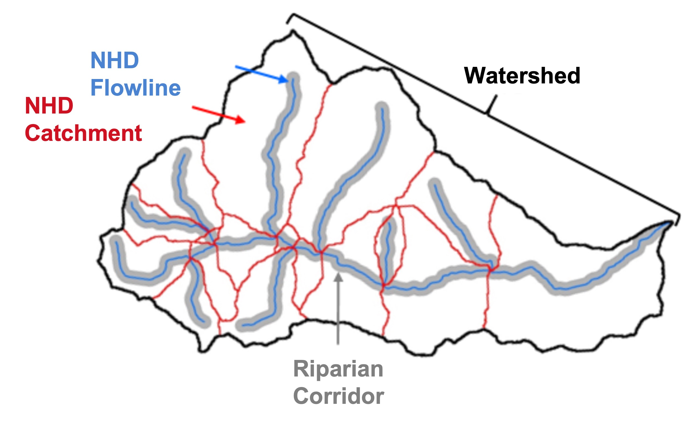

```{r setup, include=TRUE}
knitr::opts_chunk$set(echo = TRUE, message = FALSE, warning = FALSE)
```

# Using `StreamCatTools`

In the last lesson, we learned how to pull flowline and catchment data from the NHD, and "travel" through its flowline network. In this lesson, we will be exploring [StreamCat](https://www.epa.gov/national-aquatic-resource-surveys/streamcat-dataset), an Environmental Protection Agency database that has linked up hundreds of geospatial datasets to the NHD. Using similar tracing techniques to the ones we explored in the last lesson, [catchment-scale, watershed-scale, and riparian-scale statistics](https://www.epa.gov/national-aquatic-resource-surveys/streamcat-dataset-readme) have been derived for each catchment in the NHD. Very recently, the EPA developed an R package, `StreamCatTools`, that makes it *insanely* easy to load in StreamCat data from StreamCat's new [new API](https://intranet.ord.epa.gov/sswr/streamcat-web-tools).



## Loading in necessary packages

Beyond `StreamCatTools`, we will be using the `tidyverse` (like always!), `sf` and `mapview` to display geospatial data, `kableExtra` for interactive tables, and `nhdplusTools` to pull in NHD features.

```{r}
#library(devtools)
#install_github('USEPA/StreamCatTools')

library(tidyverse)
library(StreamCatTools)
library(sf)
library(mapview)
library(nhdplusTools)
library(kableExtra)
```

## Selecting a study location

Let's travel closer to home and explore geospatial data in the Colorado Front Range. The vast majority of this area is represented within the USGS gage "South Platte River Near Kersey, CO" (USGS-06754000)'s watershed:

```{r}
s_platte_ws <- get_nldi_basin(list(featureSource = "nwissite", featureID = "USGS-06754000"))

s_platte_flowlines <- nhdplusTools::get_nhdplus(AOI = s_platte_ws, 
                                                realization = "flowline") 

s_platte_catchments <- nhdplusTools::get_nhdplus(AOI = s_platte_ws, 
                                                 realization = "catchment") %>%
  # remove catchments that aren't technically in the watershed
  dplyr::filter(featureid %in% s_platte_flowlines$comid | sf::st_covered_by(., s_platte_ws, sparse = FALSE))

mapview(s_platte_catchments) + mapview(s_platte_ws)
```

There are currently 581 geospatial datasets available in StreamCat. Each of these variables can be summarized (often this means averaged) at the catchment or watershed level. Moreover, you can summarize the data solely along the riparian corridor, which they define as a 50 meter radius around the catchment's associated flowline feature. A complete list of StreamCat variables can be found [here](https://www.epa.gov/national-aquatic-resource-surveys/streamcat-metrics-and-definitions).

## Loading in StreamCat data

I am curious to see how urbanization, namely the percent of land considered impervious, looks across the watershed; I'm also curious about how it has changed through time. For this we will want to pull in information from the "Mean Imperviousness" National Land Cover Dataset product. We can load specific datasets, summarized over a selected area (i.e., catchment/watershed, riparian corridor/entire land area) for all of our `comid`s within the South Platte Basin with `sc_get_data()`:

```{r}
pctImp <- StreamCatTools::sc_get_data(metric = 'pctImp2001,pctImp2019', 
                                      aoi = 'catchment,riparian_catchment', 
                                      comid = s_platte_catchments$featureid) %>%
  # create new variables that are the difference in imperviousness between years:
  mutate(PctChangeCat = PCTIMP2019CAT-PCTIMP2001CAT,
         PctChangeRipCat = PCTIMP2019CATRP100 - PCTIMP2001CATRP100) %>%
   # remove variables we don't particularly care about:
  select(-contains("AREASQKM"))

# link this data to our catchment features:
pctImp_s_platte <- s_platte_catchments %>%
  sp::merge(pctImp, by.x = "featureid", by.y = "COMID") 
```

We now have a spatial data set representing the mean percent imperviousness of each catchment, and each catchment's riparian corridor, for the years 2001 and 2019. What does this information look like when we map it?

```{r}
mapview(pctImp_s_platte,
        zcol = "PctChangeCat", 
        layer.name = "% Change")
```

**Map 1:** 2001-2019 change in the percentage of impervious surface area across the South Platte watershed, by catchment.

```{r}
mapview(pctImp_s_platte, 
        zcol = "PctChangeRipCat",
        layer.name = "% Change")
```

**Map 2:** 2001-2019 change in the percentage of impervious surface area across the South Platte watersheds's riparian corridor, by catchment.

## Questions

Using an amalgamation of the skills you've learned thus far, explore at least *three* different StreamCat variables in the following three watersheds:

Cache la Poudre River (comid = 2903809)

Big Thompson River (comid = 15526)

St. Vrain River (comid = 2890930)

### Question 1:

How do your variables compare across the three watersheds? Visualize this data with `mapview()`.

```{r}

```

### Question 2:

How do these variables compare *within* the watersheds? Are there variable "hot spots" in any of your watersheds? Once again, visualize this data with `mapview()`.

```{r}

```
